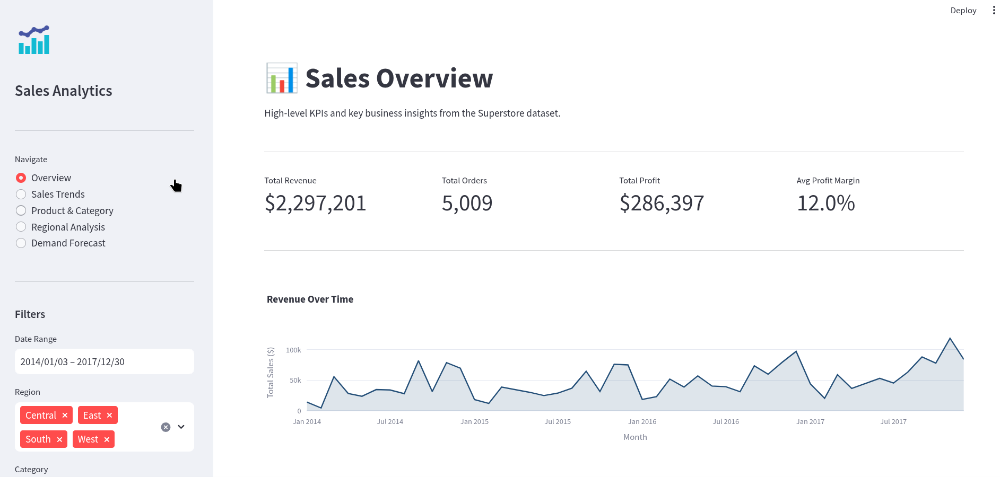
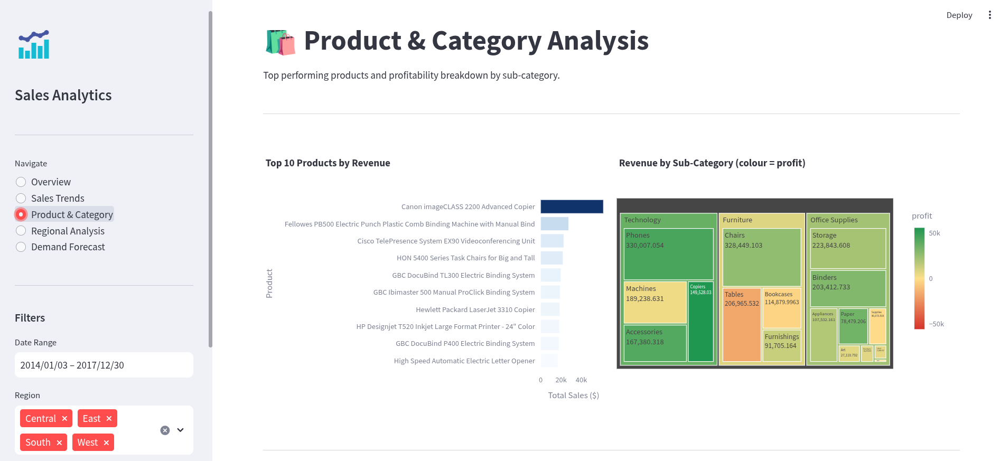
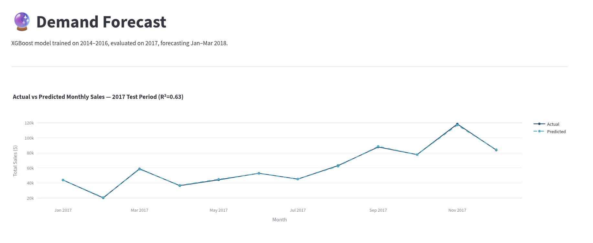

# 📊 Sales Analytics & Demand Forecasting Dashboard

An end-to-end data analytics and machine learning project analysing 10,000+
retail transactions to surface business insights and forecast future demand.



---

## 🛠️ Tech Stack


---

## 📌 Project Overview

Retail businesses struggle with overstocking, poor demand visibility, and
lack of data-driven decision making. This project simulates a real business
intelligence system that:

- Analyses 4 years of historical sales data (2014–2017)
- Identifies trends, top products, regional performance, and profitability
- Forecasts monthly demand using an XGBoost model
- Presents everything in an interactive Streamlit dashboard

---

## 🚀 How to Run
```bash
git clone https://github.com/[your-username]/sales-analytics-dashboard.git
cd sales-analytics-dashboard

conda create -n sales-analytics python=3.11.9
conda activate sales-analytics

pip install -r requirements.txt

streamlit run dashboard/app.py
```

Dataset: Download [Superstore CSV](https://www.kaggle.com/datasets/vivek468/superstore-dataset-final)
and place it at `data/superstore.csv`.

---

## 📊 Dashboard Pages

| Page | Description |
|---|---|
| Overview | KPI cards, revenue trend, key business insights |
| Sales Trends | Monthly and quarterly revenue patterns |
| Product & Category | Top products, sub-category profitability treemap |
| Regional Analysis | Sales and profit margin by region |
| Demand Forecast | Actual vs predicted + 3-month forward outlook |




---

## 💡 Key Business Insights

1. **Revenue is Q4-dependent** — every year shows a sharp November spike followed
   by a steep January drop. Mid-year promotions could smooth distribution.

2. **Tables sub-category operates at a loss** — $207k in revenue but negative
   profit margin. Pricing and discount strategy needs an urgent audit.

3. **Central region has the worst profit-to-sales ratio** — high sales volume
   but margins far below West and East. Likely an over-discounting issue.

4. **Discounts above 40% almost always produce losses** — the data shows a clear
   threshold effect. Capping discounts at 20% is the data-driven recommendation.

5. **Technology is the highest-risk, highest-reward category** — spikes hardest
   in Q4 and is most sensitive to inventory planning.

6. **Canon imageCLASS Copier is a single-SKU revenue risk** — generates nearly
   double the revenue of the next product. Stock management is critical.

---

## 🤖 Forecasting Model

- **Model:** XGBoost Regressor
- **Features:** Lag windows (1, 3 months), rolling averages (3, 6 months),
  cyclical month encoding, Q4 flag, linear trend index
- **Train/Test split:** 2014–2016 train | 2017 test (temporal split)
- **Performance:** R²=0.63, MAE=$12,531, RMSE=$15,644
- **Forecast:** Jan–Mar 2018 with ±15% confidence band

---

## 📁 Project Structure
```
sales-analytics-dashboard/
├── data/                    # Dataset and model outputs
├── notebooks/               # EDA and forecasting notebooks
├── src/                     # Core Python modules
│   ├── data_loader.py
│   ├── features.py
│   └── model.py
├── dashboard/
│   └── app.py               # Streamlit dashboard
├── screenshots/             # Dashboard screenshots
└── requirements.txt
```

---

## 🔮 What I Would Do With More Time

- Add Prophet or SARIMA for comparison against XGBoost
- Expand forecast to product/region level, not just total monthly sales
- Deploy to Streamlit Cloud for public access
- Add anomaly detection to flag unusual sales months automatically